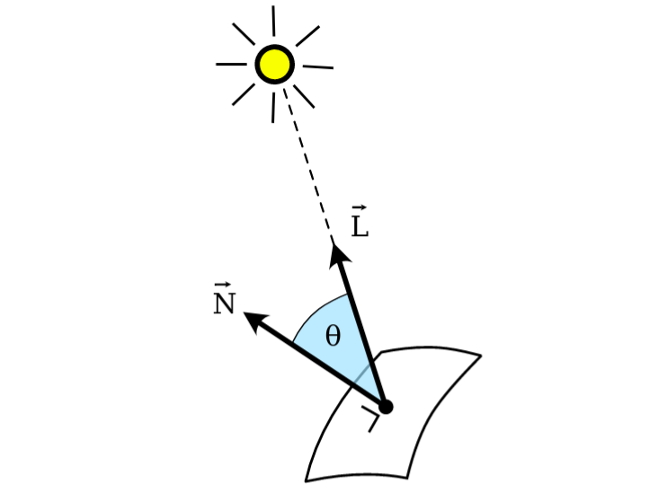
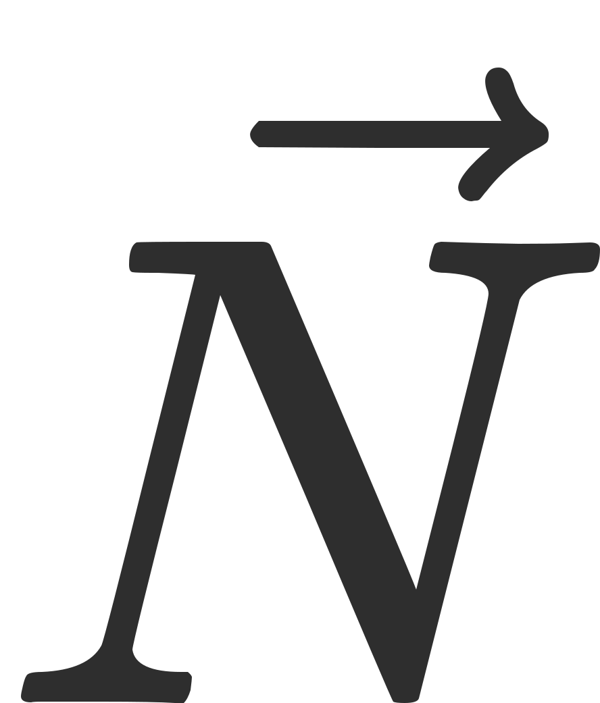
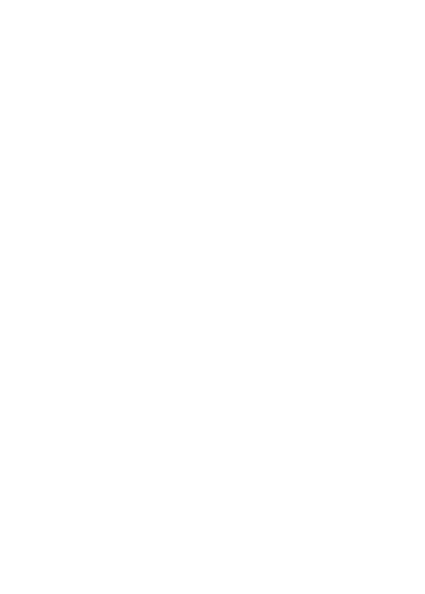
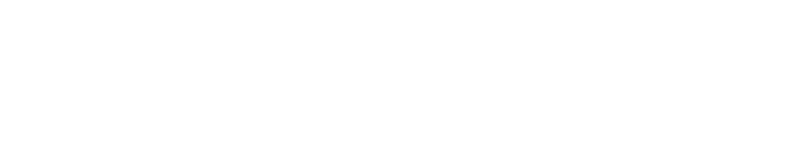
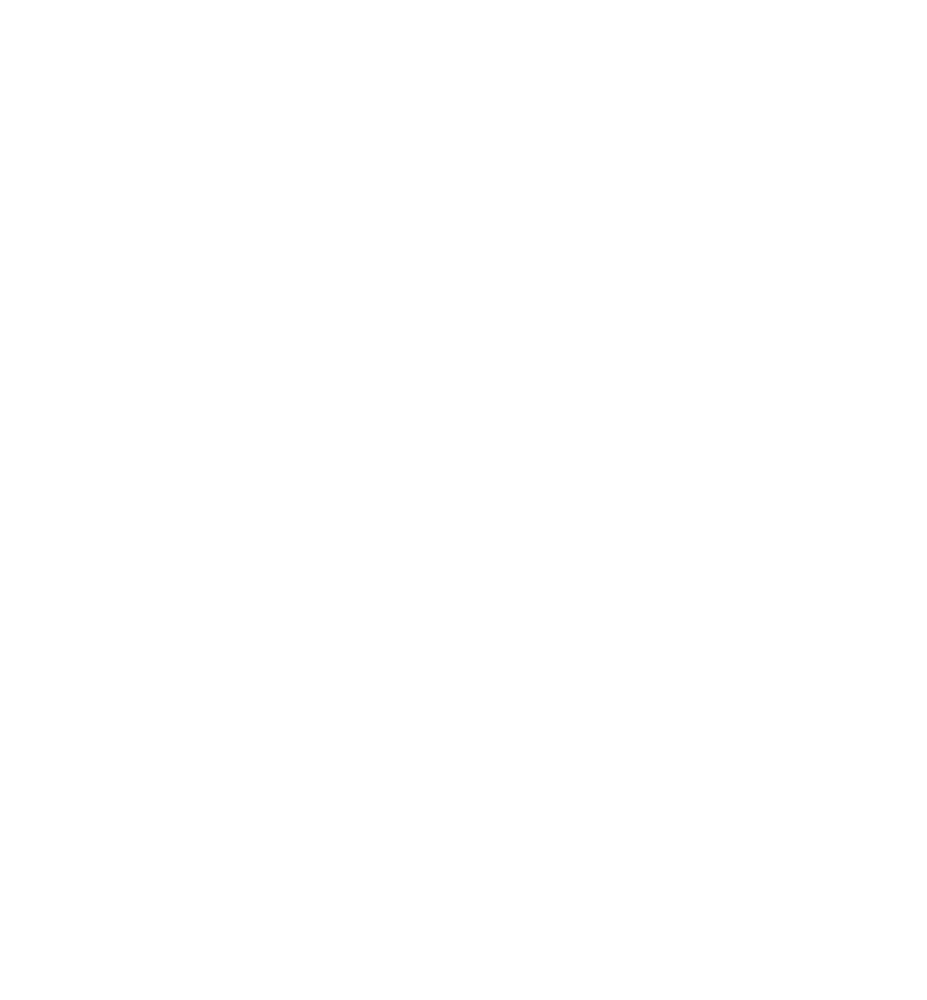
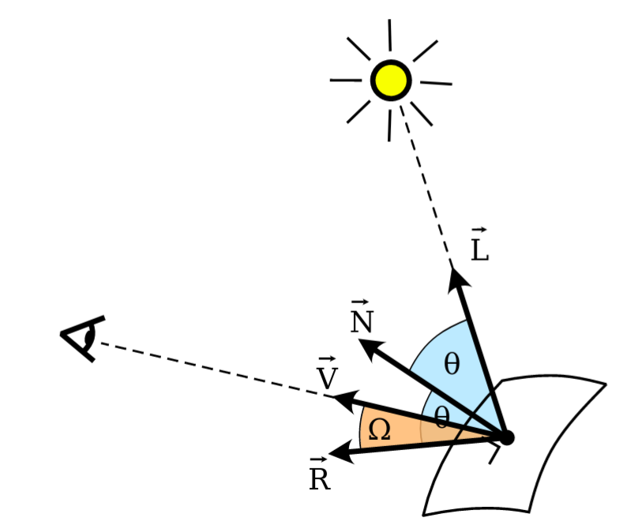
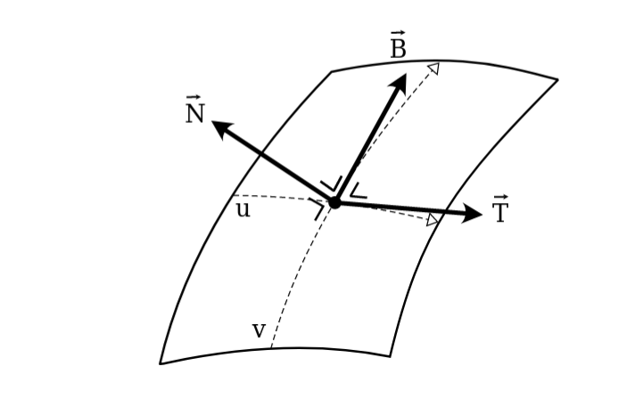
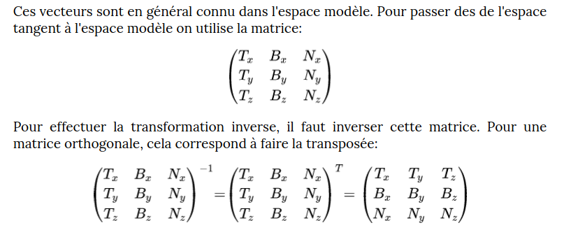

# LABO 2 & 3: shaders

## Setup

The makefile works for linux for now
in the `labo 2 & 3` folder, in the terminal run :
```
$ make
$ ./app
```

The course objective : https://quentin.lurkin.xyz/courses/gpu/labo2_3/index.html

## Objectives

From the repo : https://github.com/qlurkin/raylib-scene
- configure the env
- charge [bunny.obj](https://raw.githubusercontent.com/qlurkin/raylib-scene/shader/assets/models/bunny.obj)
- add the texture [texel](https://github.com/qlurkin/raylib-scene/blob/shader/assets/textures/texel_checker.png)

  

## Theory

- Course : https://quentin.lurkin.xyz/courses/gpu/labo2_3/index.html
- Great tutorial : https://learnopengl.com/Lighting/Basic-Lighting
- Diffuse Light : https://www.tomdalling.com/blog/modern-opengl/06-diffuse-point-lighting/
- Basic lighnting : https://learnopengl.com/Lighting/Basic-Lighting
- Light : http://www.c-jump.com/bcc/common/Talk3/OpenGL/Wk06_light/Wk06_light.html

### 1. Diffuse light

Diffused light corresponds to the light bouncing (on a surface) in every directions. It doesn't depend on the point of view.

  

The vectors are :


- <div align="left"> which is the normal vector of the surface</div> 
- <div align="left"> which is directed to the light</div> 
Both of them are of vector norm of 1.  

<div align="left">The diffused intensity, bounced by the surface  is :</div>  
<div align="center"></div>  
<div align="left">Where is the diffused color (the color of the object). The colors are vectors (r,g,b).</div> 


`Write shaders that apply this formula for each fragment`.  
  


### 2. Specular lightning

It corresponds to the reflection of the light source on a surface. It depends on the point of view.  
  

The vectors are :
- N which is the normal vector of the surface
- L which is directed to the light
- R is the reflected vector
- V is the vector directed to the camera  
All of them are of vector norm of 1.  

The reflected specular intensity $\vec I_{s}$ is :  

$\vec I_{d}$ = ($\vec R$ $\cdot$ $\vec V$)$^a$ $\vec C_{l}$  

Where $\vec C_{l}$ is the color of the light and $\alpha$ the brillance of the material.  
We can find $\vec R$ thanks to :  
$\vec R$ = 2 ($\vec N$ $\cdot$ $\vec L$) $\vec {N}$ - $\vec{L}$  

`Modify the shaders so that they include the specular light`

### 3. Normal Mapping

The normal mappoing consists of using a texture containing normals at the surface.  
It's used to make the normal with most details vary, without adding details at the 3D geometry.  

The (r,g,b) colors of the normal texture must be converted. They vary between 0 and 1 and coordinates of a unit vector vary between -1 and 1.  
We thus apply at each component `Ni = 2Ci -1`

The normals inside the texture are given in a landmark that is tangent to the surface. This landmark is composed of 3 vectors :  

 

where 
- `N` is the normal vecor to the surface
- `T` is the tangent vector that follows the texture coordinates : `u`
- B is the binormal vector that is perpendicular to the 2 others  

`N` and `T` are data that are part of Vertex Data. `B` can be calculated with : `B = N x T`  

  

`Modify your shaders and c++ code to use an additional texture that contains the normals`

### 4. Notes

A shader is in GLSL format or hlsl.  
We go from a vertex shader => Rasterization => frag shader

1. Vertex shader  
- 3 coordinates
- we apply a transformation for each coordinate
- we prepare data for each corner  :
    - position (x, y, z)
    - normal (lightning) (nx, ny, nz)
    - texture coordinate (U, V) from (0,0) to (1, 1)
    - color
2. Rasterization
- triangle divided in fragments ~ pixels
- interpolate the values of the corners in the fragments
    - calculate the means
    - linear interpolation
3. Fragment shader
- executed once per fragment
- to draw a cube, a corner will be rendered 3 times (1 normal for each side of the cube linked to the corner)