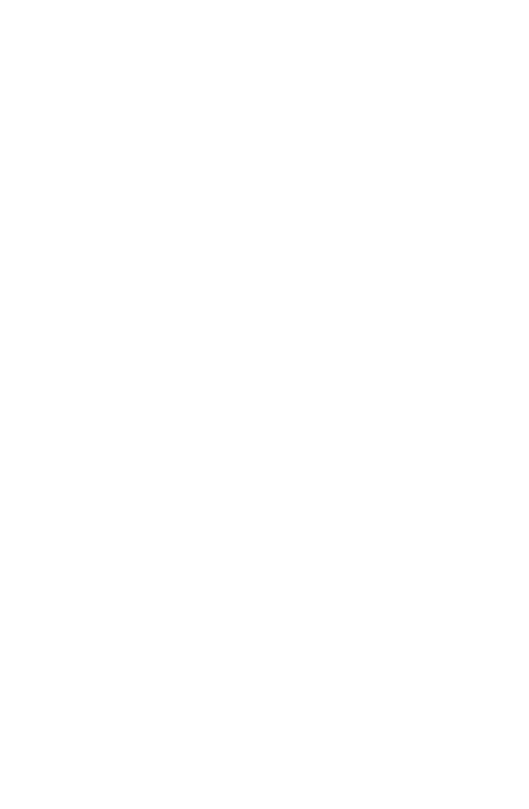

# LABO 2 & 3: shaders

## Setup

The makefile works for linux for now
in the `labo 2 & 3` folder, in the terminal run :
```
$ make
$ ./app
```

The course objective : https://quentin.lurkin.xyz/courses/gpu/labo2_3/index.html

## Objectives

From the repo : https://github.com/qlurkin/raylib-scene
- configure the env
- charge [bunny.obj](https://raw.githubusercontent.com/qlurkin/raylib-scene/shader/assets/models/bunny.obj)
- add the texture [texel](https://github.com/qlurkin/raylib-scene/blob/shader/assets/textures/texel_checker.png)

  

## Theory


### 1. Diffuse light

Diffused light corresponds to the light bouncing (on a surface) in every directions. It doesn't depend on the point of view.

  

The vectors are :
<!-- $$
\vec{L}
$$ --> 


- <div align="left"> which is the normal vector of the surface</div> 
- <div align="left"> which is directed to the light</div> 
Both of them are of vector norm of 1.  

The diffused intensity, bounced by the surface $\vec I_{d}$ is :  
    $\vec I_{d}$ = ($\vec N$ $\cdot$ $\vec L$) $\vec C_{d}$  

where $\vec C_{d}$ is the diffused color (the color of the object). The colors are vectors (r,g,b).  

`Write shaders that apply this formula for each fragment`.  
  


### 2. Specular lightning

It corresponds to the reflection of the light source on a surface. It depends on the point of view.  
  

The vectors are :
- $\vec N$ which is the normal vector of the surface
- $\vec L$ which is directed to the light
- $\vec{R}$ is the reflected vector
- $\vec{V}$ is the vector directed to the camera  
All of them are of vector norm of 1.  

The reflected specular intensity $\vec I_{s}$ is :  

$\vec I_{d}$ = ($\vec R$ $\cdot$ $\vec V$)$^a$ $\vec C_{l}$  

Where $\vec C_{l}$ is the color of the light and $\alpha$ the brillance of the material.  
We can find $\vec R$ thanks to :  
$\vec R$ = 2 ($\vec N$ $\cdot$ $\vec L$) $\vec {N}$ - $\vec{L}$  

`Modify the shaders so that they include the specular light`

### 3. Normal Mapping

### 4. Useful GLSL functions